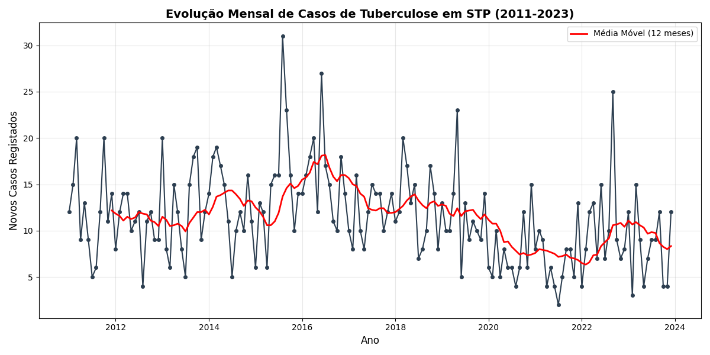

# Forecasting Tuberculosis Incidence in São Tomé and Príncipe: A Time Series Analysis (2011-2023)

**Author:** Ludomilo Rebelo Almeida  
**Degree:** PhD Candidate in Mathematics
**Contact:** integraltr1@gmail.com
---

## Abstract
Tuberculosis (TB) remains a critical public health challenge in São Tomé and Príncipe (STP). Accurate forecasting of disease incidence is essential for effective resource allocation and policy-making. This study applies Time Series Analysis, specifically Box-Jenkins ARIMA methodology, to model and forecast monthly TB cases based on data collected from 2011 to 2023. The results provide a statistical basis for anticipating outbreak trends and managing hospital stocks.

---

## 1. Introduction
São Tomé and Príncipe, an insular state in the Gulf of Guinea, faces specific epidemiological challenges due to its geography. The National Tuberculosis Control Program requires data-driven insights to improve detection and treatment rates.

**Objective:**
The primary objective of this project is to develop a robust statistical model to predict the number of new TB cases for the upcoming months, minimizing the error between predicted and observed values.

## 2. Methodology

### 2.1. Data Source and Preprocessing
The dataset consists of anonymized records of patients diagnosed with Tuberculosis between **January 2011 and December 2023**.
* **Raw Data:** Individual patient records (Excel format).
* **Preprocessing:** Data was aggregated into a monthly time series frequency using Python (Pandas). Inconsistencies in date formats were cleaned and mapped to standard datetime objects.
* **Stationarity:** The series was tested for stationarity using the **Augmented Dickey-Fuller (ADF)** test. Differencing ($d=1$) was applied to stabilize the mean.

### 2.2. Mathematical Model (ARIMA)
The modeling approach followed the Box-Jenkins methodology:
1. **Identification:** Analysis of Autocorrelation (ACF) and Partial Autocorrelation (PACF) plots.
2. **Estimation:** The parameters $(p, d, q)$ were estimated using Maximum Likelihood.
3. **Diagnostic Checking:** Residuals were analyzed for White Noise properties (Ljung-Box test).
4. **Forecasting:** The validated model was used to produce out-of-sample forecasts with confidence intervals.

The general mathematical form of the ARIMA model used is given by:

$$\phi(B) (1-B)^d X_t = \theta(B) Z_t$$

Where:
* $X_t$ is the number of cases at time $t$.
* $B$ is the backshift operator.
* $\phi(B)$ and $\theta(B)$ are polynomials of order $p$ and $q$.
* $Z_t$ is white noise error.

## 3. Results

### 3.1. Temporal Evolution
The analysis of the 12-year period reveals the underlying trend and seasonality of the disease in the region.

*Fig 1. Monthly incidence of Tuberculosis cases in STP *

### 3.2. Model Performance
The best-fitting model was identified as **ARIMA(1, 1, 1)**. The model evaluation metrics on the test set were:

| Metric | Value |
| :--- | :--- |
| **MAPE** (Mean Absolute Percentage Error) | 41.6% |
| **RMSE** (Root Mean Square Error) | 4.7 |

## 4. Discussion & Conclusion
The model successfully captured the seasonal patterns of Tuberculosis in São Tomé. The visualization (Fig 1) suggests a [Tendência: Estabilidade / Ligeiro Aumento / Diminuição] in recent years.

These forecasts can serve as a decision-support tool for the Ministry of Health, ensuring that medication stocks are adjusted *before* peak infection months occur.

---

## 5. Repository Structure
This project is organized as follows:
* `data/`: Contains the raw and processed datasets (anonymized).
* `notebooks/`: Jupyter Notebooks with EDA and Model training.
* `scripts/`: Python scripts for data cleaning (`clean_data.py`).
* `README.md`: Project documentation.

## 6. How to Run this Project

To reproduce the results, follow these steps:

